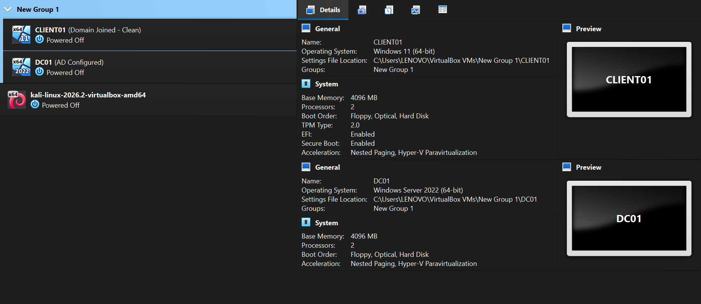

# Install Oracle VirtualBox

[Virtualization Overview](../../README.md) | [Lab Setup Overview](README.md) | [Next: Create Virtual Machines](02%20-%20Create%20and%20Configure%20Virtual%20Machines.md)

---

## Overview

Oracle VirtualBox is a free and open-source Type 2 hypervisor developed by Oracle. It allows multiple operating systems to run simultaneously on a single physical computer by creating Virtual Machines (VMs).

In this lab, Oracle VirtualBox is used to create a Windows Server virtual machine (`DC01`) and a Windows 11 virtual machine (`CLIENT01`). These virtual machines will serve as the foundation for learning Windows Administration, Active Directory, and SOC Analyst concepts throughout this repository.

---

## Learning Objectives

By the end of this guide, you will be able to:

- Understand what Oracle VirtualBox is.
- Explain why virtualization is used.
- Install Oracle VirtualBox on Windows.
- Verify that the installation completed successfully.

---

# Why Oracle VirtualBox?

Instead of installing Windows Server directly on a physical computer, virtualization allows multiple operating systems to run independently without modifying or affecting the host operating system.

Some advantages of using Oracle VirtualBox include:

- Run multiple operating systems on a single computer.
- Build enterprise lab environments without additional hardware.
- Safely test and experiment with system configurations.
- Restore previous working states using snapshots.
- Practice Windows Administration and SOC Analyst skills in an isolated environment.

---

# System Requirements

Before installing Oracle VirtualBox, ensure your computer meets the following recommended requirements.

| Component | Recommended |
|-----------|-------------|
| Operating System | Windows 10 / Windows 11 (64-bit) |
| Memory (RAM) | 16 GB or higher |
| Processor | Intel VT-x or AMD-V supported processor |
| Storage | Minimum 120 GB available disk space |

---

# Download Oracle VirtualBox

1. Visit the official Oracle VirtualBox website.
2. Download the latest Windows installer.
3. Run the installer with Administrator privileges.
4. Keep the default installation settings unless a different configuration is required.
5. Allow Windows to install Oracle networking drivers when prompted.
6. Restart the computer if required.

---

# Verify the Installation

After the installation is complete:

1. Open **Oracle VirtualBox**.
2. Verify that the application starts without errors.
3. Confirm that the VirtualBox Manager window opens successfully.
4. Ensure you are able to create and manage virtual machines.

If all these checks are successful, Oracle VirtualBox is ready to host the Windows Administration Lab.

---

# Screenshots

| Screenshot | Description |
|------------|-------------|
|  | Oracle VirtualBox Manager showing the virtual machines used in this lab. |

---

# Outcome

Oracle VirtualBox has been successfully installed and verified. The virtualization environment is now ready for creating and managing the virtual machines that will be used throughout this Windows Administration Lab.

---

# Key Takeaways

- Oracle VirtualBox is a **Type 2 Hypervisor**.
- Virtualization allows multiple operating systems to run on a single physical computer.
- Virtual Machines provide a safe and isolated environment for learning and testing.
- Oracle VirtualBox serves as the foundation of the Windows Administration Lab.

---

## Navigation

← Previous: [Lab Setup Overview](README.md)

→ Next: [Create and Configure Virtual Machines](02%20-%20Create%20and%20Configure%20Virtual%20Machines.md)

---
**Last Updated:** September 2026