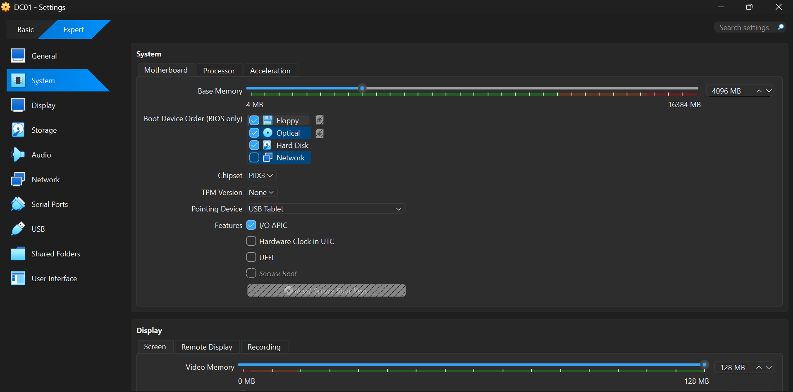
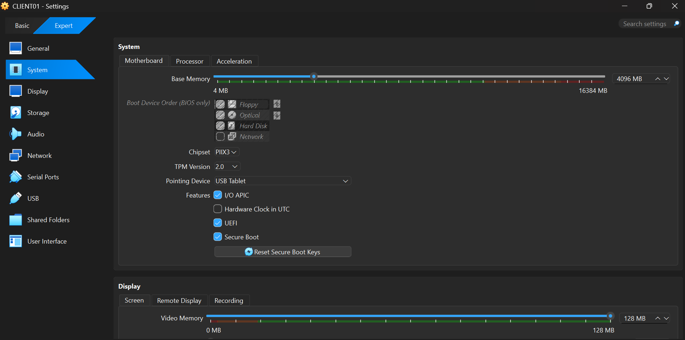
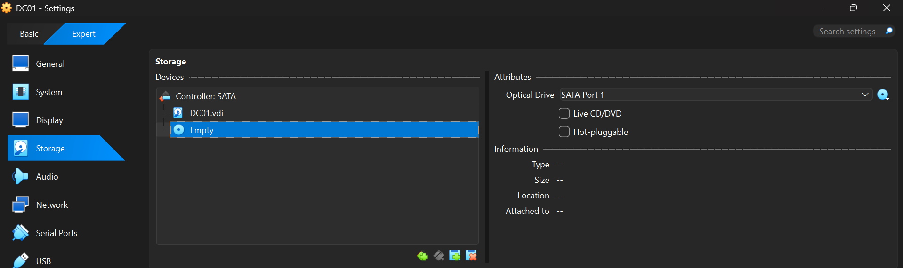
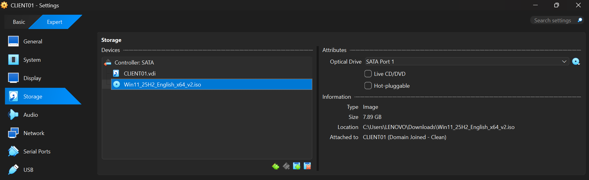

# Create Virtual Machines

## Overview

This guide explains how to create the two virtual machines used throughout the Windows Administration Lab.

The lab consists of:

- **DC01** - Windows Server 2022 (Domain Controller)
- **CLIENT01** - Windows 11 (Domain Client)

These virtual machines simulate a small enterprise environment and will be used for all future Windows Administration and Active Directory exercises.

---

## Learning Objectives

By the end of this guide, you will be able to:

- Create a Windows Server virtual machine.
- Create a Windows 11 virtual machine.
- Configure the hardware resources for each virtual machine.
- Attach the required installation ISO files.
- Prepare both virtual machines for operating system installation.

---

# Virtual Machine 1 - DC01

## Purpose

DC01 will serve as the Domain Controller for the lab. It will later host services such as:

- Active Directory Domain Services (AD DS)
- DNS
- DHCP
- Group Policy

---

## Configuration

| Setting | Value |
|---------|-------|
| Machine Name | DC01 |
| Operating System | Windows Server 2022 Standard Evaluation |
| Memory (RAM) | 4096 MB |
| Processors | 2 |
| Virtual Hard Disk | 80 GB (VDI, Dynamically Allocated) |

Attach the Windows Server 2022 ISO before starting the virtual machine.

---

# Virtual Machine 2 - CLIENT01

## Purpose

CLIENT01 represents a workstation used by employees in an organization. It will later be joined to the Active Directory domain created on DC01.

---

## Configuration

| Setting | Value |
|---------|-------|
| Machine Name | CLIENT01 |
| Operating System | Windows 11 |
| Memory (RAM) | 4096 MB |
| Processors | 2 |
| Virtual Hard Disk | 60 GB (VDI, Dynamically Allocated) |

Attach the Windows 11 ISO before starting the virtual machine.

---

# Verify the Configuration

Before installing the operating systems, verify the following for both virtual machines:

- The machine name is correct.
- Memory allocation is correct.
- Processor count is correct.
- Virtual hard disk has been created.
- The correct ISO file is attached.

Once these checks are complete, both virtual machines are ready for Windows installation.

---

# Screenshots

| Screenshot | Description |
|------------|-------------|
|  | VirtualBox settings showing the hardware configuration of the DC01 virtual machine. |
|  | VirtualBox settings showing the hardware configuration of the CLIENT01 virtual machine. |
|  | Windows Server 2022 ISO attached to the DC01 virtual machine. |
|  | Windows 11 ISO attached to the CLIENT01 virtual machine. |

---

# Outcome

At the end of this guide, both virtual machines have been created with the required hardware configuration and installation media. They are now ready for installing Windows Server and Windows 11.

---

# Key Takeaways

- Two virtual machines are required for this lab.
- DC01 will become the Domain Controller.
- CLIENT01 will become the domain-joined workstation.
- Proper hardware allocation ensures stable performance during future lab exercises.
- The installation ISO must be attached before booting each virtual machine.

---

## Navigation

← Previous: [Install Oracle VirtualBox](01%20-%20Install%20VirtualBox.md)

→ Next: [Configure Networking](03%20-%20Configure%20Networking.md)

---

**Last Updated:** September 2026