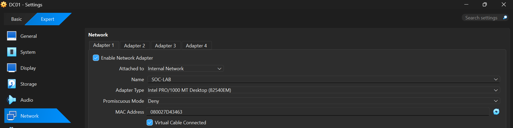
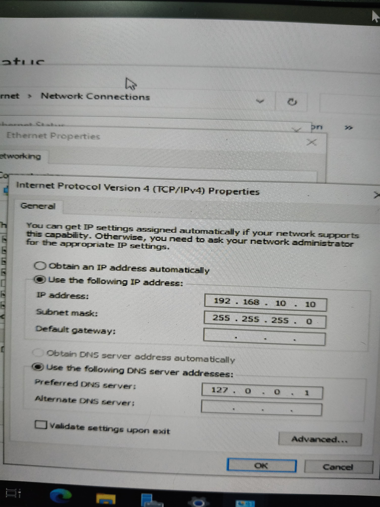
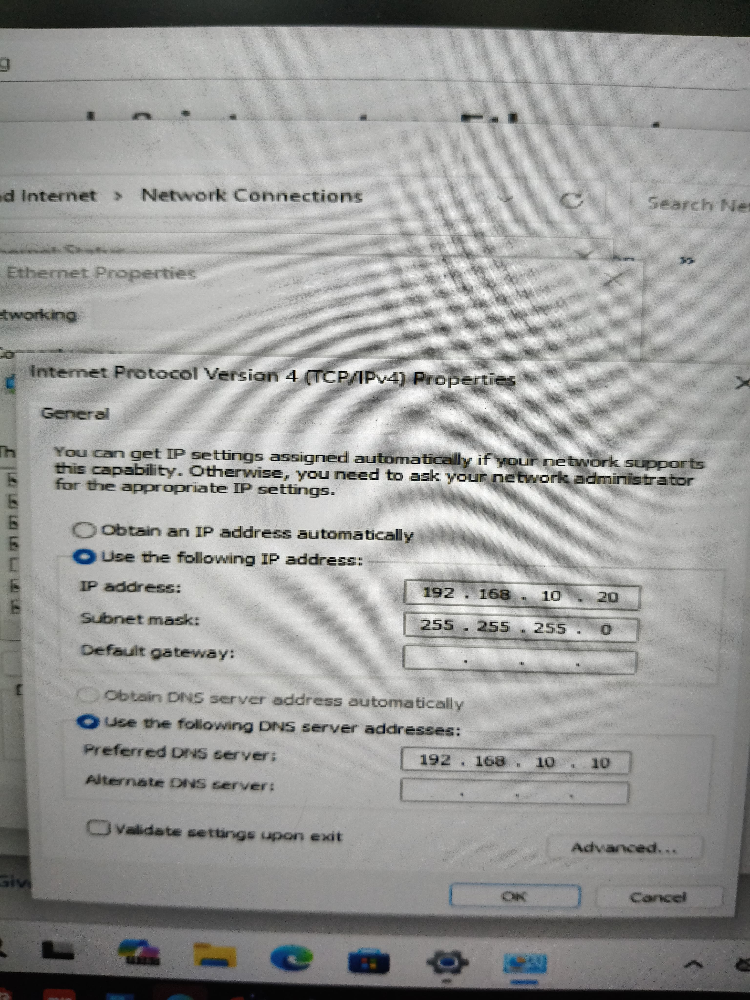

# Configure Networking

## Overview

Networking is one of the most important components of this lab. Without proper network connectivity, the Windows Server and Windows 11 virtual machines cannot communicate with each other.

In this guide, both virtual machines are configured to use an **Internal Network** named **SOC-LAB**. This creates an isolated network where only the virtual machines can communicate, making it ideal for Windows Administration and Active Directory labs.

---

## Learning Objectives

By the end of this guide, you will be able to:

- Understand the purpose of an Internal Network.
- Configure VirtualBox networking for both virtual machines.
- Assign static IP addresses.
- Configure the DNS server.
- Verify that both virtual machines are connected to the same network.

---

# Why Use an Internal Network?

VirtualBox provides several networking modes, such as NAT, Bridged Adapter, Host-Only Adapter, and Internal Network.

For this lab, an **Internal Network** is used because:

- It allows communication only between virtual machines.
- It isolates the lab from the host network.
- It creates a safe environment for testing Windows Administration and security concepts.
- It closely resembles a private enterprise network.

---

# Configure the VirtualBox Network

For both **DC01** and **CLIENT01**:

1. Open **VirtualBox**.
2. Select the virtual machine.
3. Click **Settings**.
4. Open the **Network** tab.
5. Configure the following settings:

| Setting | Value |
|----------|-------|
| Adapter 1 | Enabled |
| Attached To | Internal Network |
| Network Name | SOC-LAB |

Apply the same configuration to both virtual machines.

---

# Configure Static IP Addresses

After installing Windows, assign the following static IP addresses.

## DC01

| Setting | Value |
|----------|-------|
| IP Address | 192.168.10.10 |
| Subnet Mask | 255.255.255.0 |
| Preferred DNS Server | 192.168.10.10 |

---

## CLIENT01

| Setting | Value |
|----------|-------|
| IP Address | 192.168.10.20 |
| Subnet Mask | 255.255.255.0 |
| Preferred DNS Server | 192.168.10.10 |

The client uses **DC01** as its DNS server because the Domain Controller will later host the DNS service for the Active Directory environment.

---

# Verify the Configuration

Before proceeding, verify the following:

- Both virtual machines are powered on.
- Both machines are connected to the **SOC-LAB** Internal Network.
- Static IP addresses are configured correctly.
- The DNS server on CLIENT01 points to **192.168.10.10**.

---

# Screenshots

| Screenshot | Description |
|------------|-------------|
|  | VirtualBox network settings showing Adapter 1 configured as an Internal Network named **SOC-LAB**. |
|  | IPv4 configuration of the DC01 virtual machine. |
|  | IPv4 configuration of the CLIENT01 virtual machine. |

---

## Common Mistakes

- The virtual machines are connected to different network types (e.g., NAT and Internal Network).
- The Internal Network names do not match exactly.
- Duplicate IP addresses are assigned.
- CLIENT01 is configured with the wrong DNS server.
- Static IP settings are not applied correctly.

--- 

# Outcome

At the end of this guide, both virtual machines are connected to the same Internal Network and have been assigned static IP addresses. The networking environment is now ready for connectivity testing and future Active Directory deployment.

---

# Key Takeaways

- An Internal Network provides isolated communication between virtual machines.
- Both virtual machines must use the same Internal Network name (**SOC-LAB**).
- Static IP addresses ensure consistent communication.
- CLIENT01 uses DC01 as its DNS server for future domain services.

---

## Navigation

← Previous: [Create and Configure Virtual Machines](02%20-%20Create%20and%20Configure%20Virtual%20Machines.md)

→ Next: [Verify Connectivity](04%20-%20Verify%20Connectivity.md)

---

**Last Updated:** September 2026