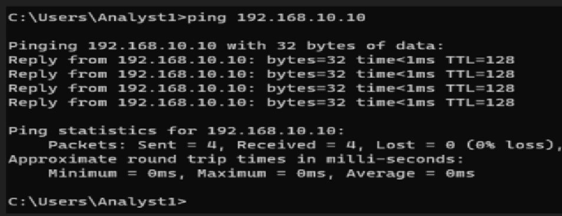
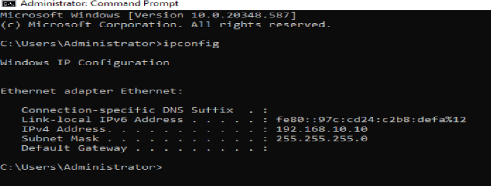
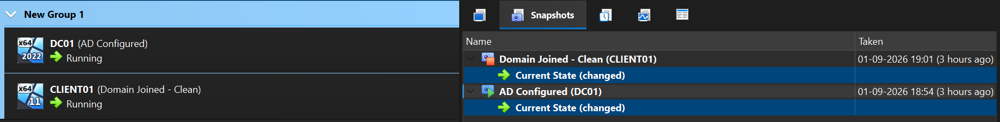

# Verify Connectivity

[Virtualization Overview](../../README.md) | [Lab Setup Overview](README.md) | [Previous: Configure Networking](03%20-%20Configure%20Networking.md) | [Next Track: Windows Server Fundamentals](../../02%20-%20Windows%20Server%20Fundamentals/README.md)

---

## Overview

After creating the virtual machines and configuring the network, the final step is to verify that both systems can communicate successfully.

Connectivity testing confirms that the networking configuration is correct and that the lab is ready for Active Directory deployment and other Windows Administration tasks.

---

## Learning Objectives

By the end of this guide, you will be able to:

- Verify network connectivity between the virtual machines.
- Test communication using the `ping` command.
- Validate the configured IP addresses.
- Confirm that the lab is ready for future configuration.

---

# Why Verify Connectivity?

Before deploying services such as Active Directory, DNS, or DHCP, it is important to ensure that both virtual machines can communicate over the network.

Verifying connectivity helps identify configuration issues early and prevents troubleshooting more complex problems later in the lab.

---

# Verify the Network Configuration

Before running any tests, confirm the following:

- Both virtual machines are powered on.
- Both virtual machines are connected to the **SOC-LAB** Internal Network.
- Static IP addresses are configured correctly.
- The Windows Firewall allows ICMP Echo Requests (Ping).

---

# Test Communication

## From DC01

Open Command Prompt and run:

```cmd
ping 192.168.10.20
```

Expected Result:

```text
Reply from 192.168.10.20
```

---

## From CLIENT01

Open Command Prompt and run:

```cmd
ping 192.168.10.10
```

Expected Result:

```text
Reply from 192.168.10.10
```

Successful replies confirm that both virtual machines can communicate over the Internal Network.

---

# Verify the IP Configuration

Run the following command on both virtual machines:

```cmd
ipconfig
```

Verify that the displayed IP addresses match the configured static IP settings.

---

# Create VirtualBox Snapshots

After successfully verifying connectivity, create snapshots of both virtual machines.

Suggested snapshot names:

| Virtual Machine | Snapshot Name |
|-----------------|---------------|
| DC01 | Clean Windows Server |
| CLIENT01 | Clean Windows 11 |

These snapshots provide a stable restore point before installing Windows Server roles and configuring Active Directory.

---

# Screenshots

| Screenshot | Description |
|------------|-------------|
|  | Successful ping replies between DC01 and CLIENT01. |
|  | Output of the `ipconfig` command showing the configured static IP address. |
|  | Snapshot Manager displaying the snapshots created after completing the lab setup. |

---

# Common Mistakes

- One or both virtual machines are powered off.
- The virtual machines are connected to different VirtualBox network types.
- Static IP addresses are configured incorrectly.
- The Windows Firewall blocks ICMP (Ping) requests.
- Incorrect DNS server configuration on CLIENT01.

---

# Outcome

The Windows Server and Windows 11 virtual machines can successfully communicate over the Internal Network. Connectivity has been verified, and snapshots have been created to preserve a stable baseline for future lab exercises.

---

# Key Takeaways

- Connectivity should always be verified before deploying server roles.
- The `ping` command is a simple way to test basic network communication.
- The `ipconfig` command helps verify IP configuration.
- Creating snapshots provides a reliable recovery point before making major changes.

---

## Navigation

- **Previous:** [03 - Configure Networking](03%20-%20Configure%20Networking.md)
- **Setup Index:** [Lab Setup Overview](README.md)
- **Track Index:** [Virtualization Fundamentals](../../README.md)
- **Next Track:** [Windows Server Fundamentals](../../02%20-%20Windows%20Server%20Fundamentals/README.md)
- **First Windows Server Lab:** [Practical Lab 01: Windows Server Edition](../../02%20-%20Windows%20Server%20Fundamentals/Lab-Exercise.md#practical-lab-01--to-know-the-windows-server-edition)

---

**Last Updated:** September 2026